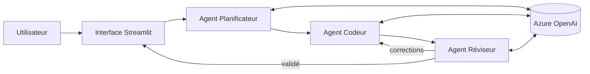

# 🤖 Agent IA Universel


Assistant IA polyvalent reposant sur **plusieurs agents AutoGen** qui collaborent
via **Azure OpenAI**, avec une interface **Streamlit** et un déploiement **Docker**.


##  Sommaire
[Présentation](#-présentation) · [Fonctionnalités](#-fonctionnalités) ·
[Architecture](#-architecture) · [Installation](#-installation) ·
[Configuration](#-configuration) · [Utilisation](#-utilisation) ·
[Docker](#-docker) · [Structure](#-structure-du-projet) ·
[Limites](#-limites-connues) · [Auteure](#-auteure)

##  Présentation
L'utilisateur pose une question dans n'importe quel domaine. Le système :
1. **Planifie** la réponse (décomposition en étapes),
2. **Produit** le contenu (texte ou code Python si nécessaire),
3. **Vérifie** le résultat avant de l'afficher.

| Agent | Rôle |
|-------|------|
| 🗂️ Planificateur | Découpe la demande en sous-tâches |
| 💻 Codeur | Génère le contenu et le code Python |
| 🔍 Réviseur | Contrôle la cohérence et la qualité, demande des corrections |

## ✨ Fonctionnalités
| Mode | Description |
|------|-------------|
|  Question | Réponse directe |
|  Solutions | 3 options avec avantages / inconvénients |
|  Explication | Explication pédagogique |
|  Résolution | Résolution pas à pas |
|  Création | Code, texte, plan… |

Autres : historique de conversation, export des échanges, interface Streamlit,
conteneurisation Docker, consommation de tokens maîtrisée
(*<précise ici la méthode : limite de tours, modèle, etc.>*).

##  Architecture


## 🛠️ Technologies
Python 3.12 · AutoGen · Azure OpenAI · Streamlit · Docker

##  Installation
```bash
git clone https://github.com/<user>/<repo>.git
cd <repo>
python -m venv .venv && source .venv/bin/activate
pip install -r requirements.txt
```

## ⚙️ Configuration
```bash
cp .env.example .env
```
```env
AZURE_OPENAI_API_KEY=...
AZURE_OPENAI_ENDPOINT=https://<resource>.openai.azure.com/
AZURE_OPENAI_DEPLOYMENT=<nom-du-déploiement>
AZURE_OPENAI_API_VERSION=<version>
```
> ⚠️ Ne committez jamais `.env` (vérifiez qu'il est dans `.gitignore`).

## ▶️ Utilisation
```bash
streamlit run app.py
```
Ouvrir http://localhost:8501, choisir un mode, poser sa question.

## 🐳 Docker
```bash
docker build -t agent-ia-universel .
docker run --env-file .env -p 8501:8501 agent-ia-universel
```

## 📁 Structure du projet
```
.
├── app.py            # Interface Streamlit
├── agents/           # Définition des agents
├── config/           # Chargement de la configuration
├── Dockerfile
├── requirements.txt
└── .env.example
```


## 👩‍💻 Auteure
**Oumaima** —   [LinkedIn] ((https://www.linkedin.com/in/oumaima-bouhani/))

## 📄 Licence
MIT — voir [LICENSE](LICENSE).
